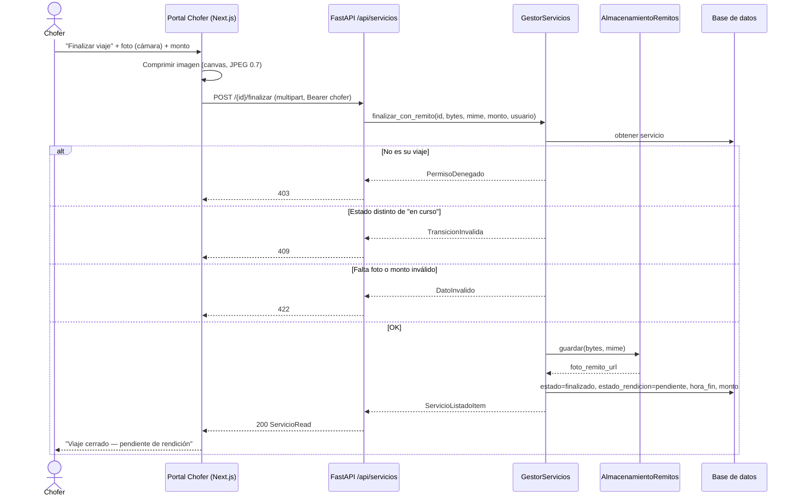
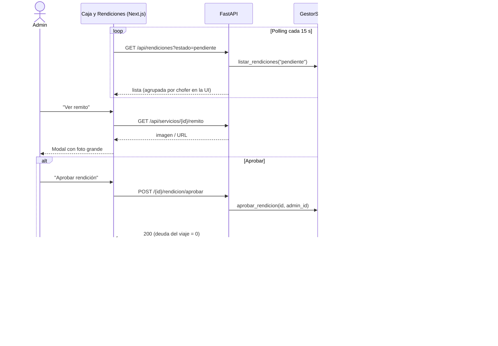
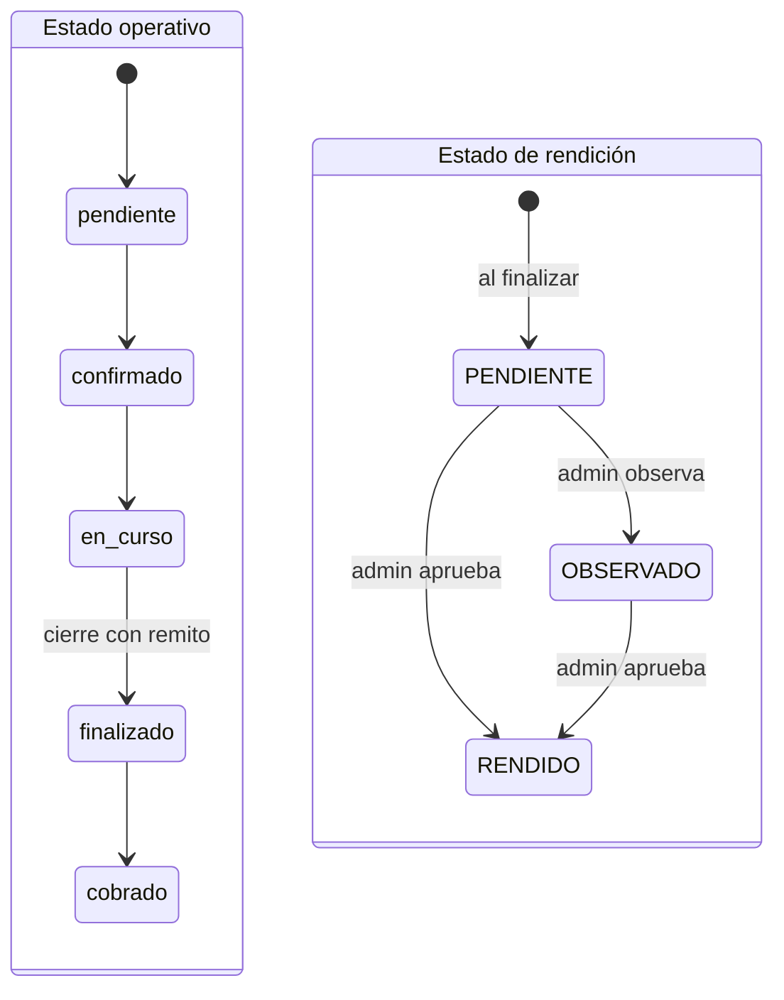

# SSD — 010 Cierre de Viaje, POD y Rendición

## SSD-1 — El chofer cierra el viaje con remito

```mermaid
sequenceDiagram
    actor Chofer
    participant UI as Portal Chofer (Next.js)
    participant API as FastAPI /api/servicios
    participant G as GestorServicios
    participant S as AlmacenamientoRemitos
    participant DB as Base de datos

    Chofer->>UI: "Finalizar viaje" + foto (cámara) + monto
    UI->>UI: Comprimir imagen (canvas, JPEG 0.7)
    UI->>API: POST /{id}/finalizar (multipart, Bearer chofer)
    API->>G: finalizar_con_remito(id, bytes, mime, monto, usuario)
    G->>DB: obtener servicio
    alt No es su viaje
        G-->>API: PermisoDenegado
        API-->>UI: 403
    else Estado distinto de "en curso"
        G-->>API: TransicionInvalida
        API-->>UI: 409
    else Falta foto o monto inválido
        G-->>API: DatoInvalido
        API-->>UI: 422
    else OK
        G->>S: guardar(bytes, mime)
        S-->>G: foto_remito_url
        G->>DB: estado=finalizado, estado_rendicion=pendiente, hora_fin, monto
        G-->>API: ServicioListadoItem
        API-->>UI: 200 ServicioRead
        UI-->>Chofer: "Viaje cerrado — pendiente de rendición"
    end
```

## SSD-2 — El administrador aprueba u observa la rendición

```mermaid
sequenceDiagram
    actor Admin
    participant UI as Caja y Rendiciones (Next.js)
    participant API as FastAPI
    participant G as GestorServicios
    participant DB as Base de datos

    loop Polling cada 15 s
        UI->>API: GET /api/rendiciones?estado=pendiente
        API->>G: listar_rendiciones("pendiente")
        G->>DB: servicios + choferes + clientes
        API-->>UI: lista (agrupada por chofer en la UI)
    end
    Admin->>UI: "Ver remito"
    UI->>API: GET /api/servicios/{id}/remito
    API-->>UI: imagen / URL
    UI-->>Admin: Modal con foto grande
    alt Aprobar
        Admin->>UI: "Aprobar rendición"
        UI->>API: POST /{id}/rendicion/aprobar
        API->>G: aprobar_rendicion(id, admin_id)
        G->>DB: estado_rendicion=rendido, rendido_en, rendido_por_id
        API-->>UI: 200 (deuda del viaje = 0)
    else Observar
        Admin->>UI: "Observar" + comentario
        UI->>API: POST /{id}/rendicion/observar {comentario}
        G->>DB: estado_rendicion=observado, observacion_rendicion
        API-->>UI: 200
    end
```

## Estados

```mermaid
stateDiagram-v2
    state "Estado operativo" as op {
        [*] --> pendiente
        pendiente --> confirmado
        confirmado --> en_curso
        en_curso --> finalizado: cierre con remito
        finalizado --> cobrado
    }
    state "Estado de rendición" as rend {
        [*] --> PENDIENTE: al finalizar
        PENDIENTE --> RENDIDO: admin aprueba
        PENDIENTE --> OBSERVADO: admin observa
        OBSERVADO --> RENDIDO: admin aprueba
    }
```
